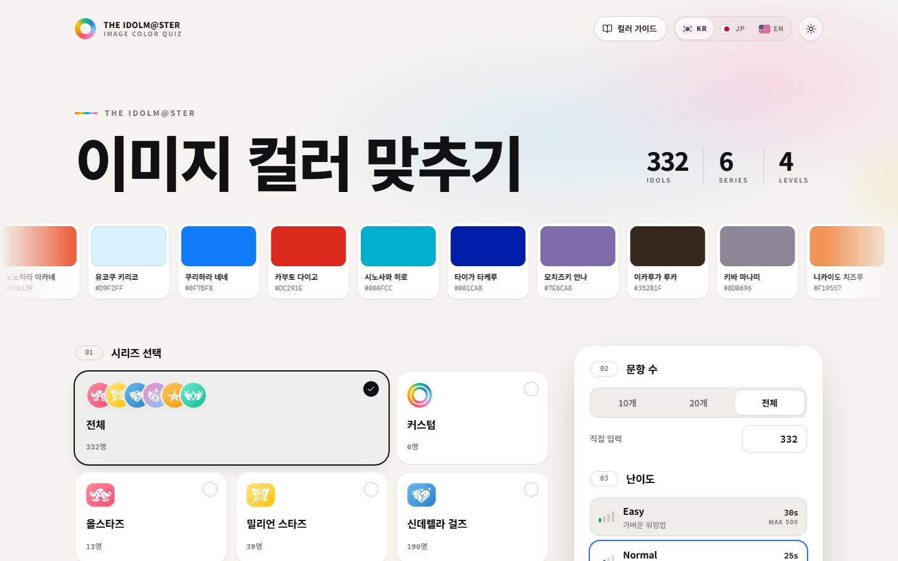
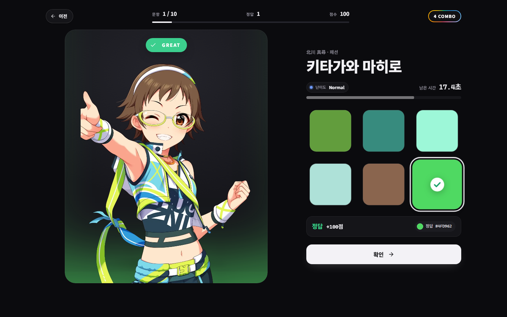
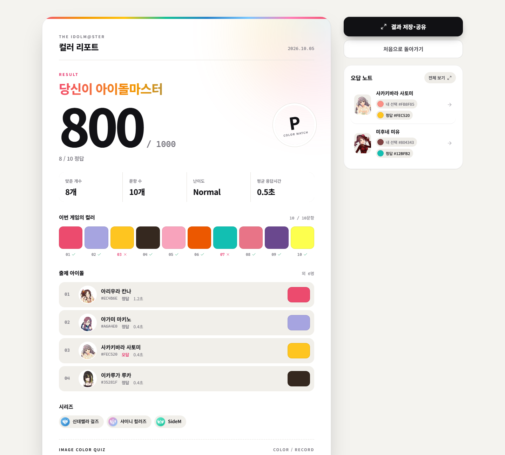
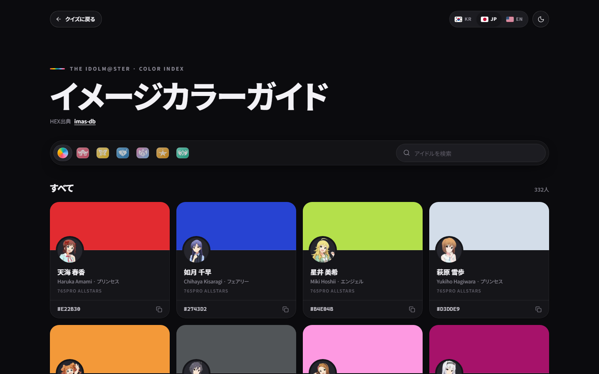

  
  
  
  
  
  

<h1 align="center">THE IDOLM@STER Image Color Quiz</h1>

Guess the image colors of 332 idols from six IDOLM@STER series.

  <a href="https://indifferentcurve.github.io/idolmaster-personal-color-quiz/"><strong>GitHub Pages</strong></a>
  &nbsp;·&nbsp;
  <a href="https://idolmaster-color-quiz.onrender.com/"><strong>Render</strong></a>

  <a href="README.ko.md">한국어</a> · <a href="README.ja.md">日本語</a> · <a href="README.en.md">English</a>

  

<table>
  <tr>
    <td width="33%"></td>
    <td width="33%"></td>
    <td width="33%"></td>
  </tr>
</table>
